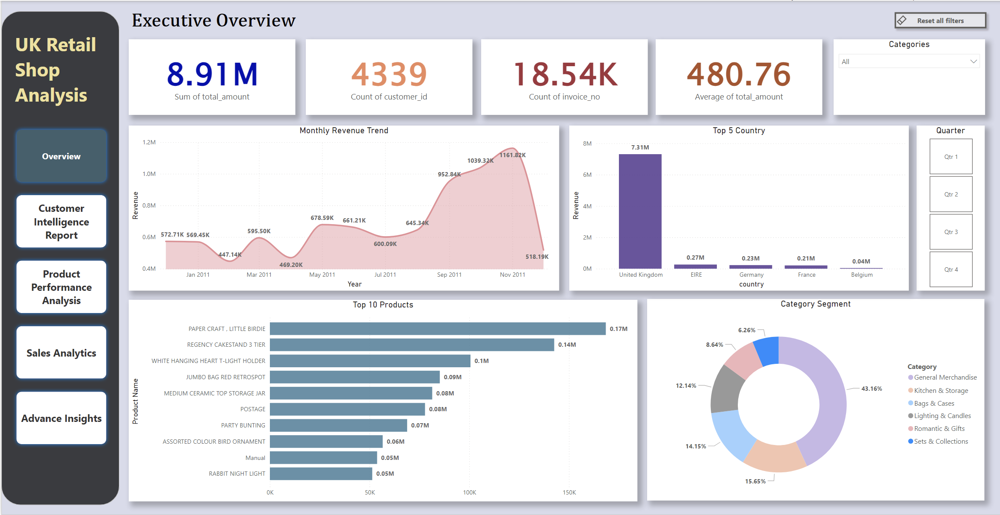
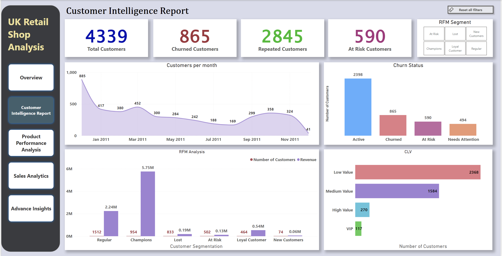
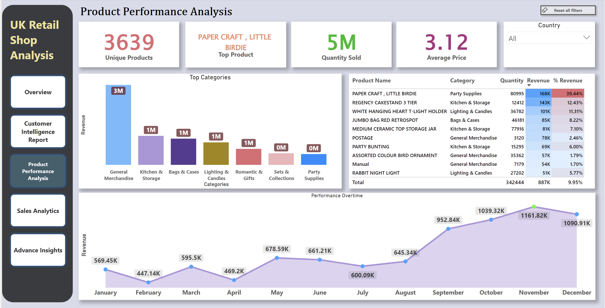
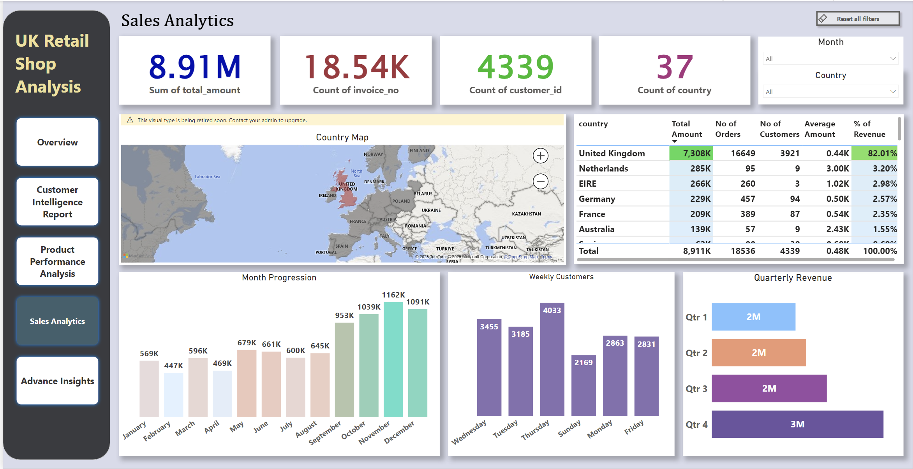
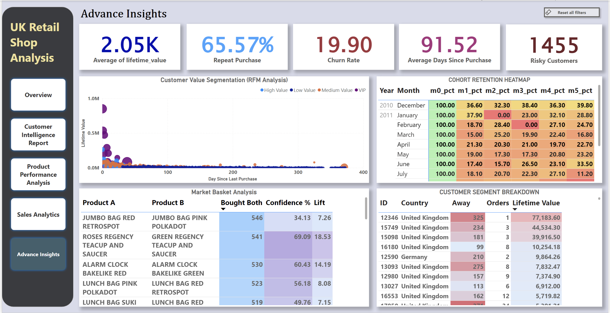

# UK Retail E-Commerce Analytics

Enterprise-grade analytics project analyzing 18,536 orders from 4,339 customers spanning December 2010 - December 2011.

## Project Overview

This project demonstrates a complete data analytics pipeline: normalized SQL database → 20 advanced queries → 5-page interactive Power BI dashboard.

**Key Findings:**
- £8.91M total revenue analyzed
- 19.82% customer churn identified (recovery opportunity: £556K)
- VIP segment (2.7% of customers) generates 37.57% of revenue
- Top product pair: JUMBO BAGS (546 co-purchases, 7.26x lift)
- 65.58% repeat purchase rate

## Quick Stats

| Metric          | Value     |
|-----------------|-----------|
| Orders          | 18,536    |
| Customers       | 4,339     |
| Revenue         | £8.91M    |
| AOV             | £480      |
| Analysis Period | 13 months |

## What's Included

- **SQL Queries (20):** RFM segmentation, churn analysis, cohort retention, market basket analysis, CLV calculation
- **Power BI Dashboard (5 pages):** Executive overview, customer intelligence, product performance, advanced insights, sales analytics
- **Database Schema:** Normalized 4-table design (customers, invoices, products, invoice_items)

## Technologies

- **Database:** PostgreSQL
- **Query Language:** SQL (Advanced: CTEs, Window Functions, NTILE)
- **BI Tool:** Power BI Desktop
- **Techniques:** RFM segmentation, cohort analysis, market basket analysis, churn prediction

## 📊 Power BI Dashboard Gallery
<p align="center">
  
  
</p>

<p align="center">
  
  
</p>

<p align="center">
  
</p>


## Key Insights

**Customer Segmentation:**
- Active: 55.24% | At Risk: 13.57% | Churned: 19.82% | Needs Attention: 11.36%

**CLV Breakdown:**
- VIP: 2.7% customers → 37.57% revenue
- High Value: 6.22% → 17.63% revenue
- Medium: 36.51% → 28.76% revenue
- Low: 54.57% → 16.03% revenue

**Business Recommendations:**
1. Deploy 60-day churn prevention campaign (£556K at risk)
2. Create VIP retention program for 117 champions customers
3. Bundle JUMBO BAG products (18.53x+ lift potential)
4. Diversify from General Merchandise (currently 35.5% revenue)

## File Structure

```
uk-retail-analytics/
├── data/
│ ├── customers.csv (4,339 rows)
│ ├── products.csv (3,665+ rows)
│ ├── invoices.csv (18,536 rows)
│ └── invoice_items.csv (397,924 rows)
├── sql/
│ └── uk_retail_queries.sql (20 queries)
├── dashboards/
│ └── uk_retail.pbix (5 pages)
│ └── uk_retail.pdf
├── documentation/
│ └── project_documentation.pdf
└── readme.md
```

## How to Use

1. Load CSV files into PostgreSQL
2. Run 20 SQL queries in `uk_retail_queries.sql`
3. Import results into Power BI Desktop
4. Open `uk_retail_dashboard.pbix` for interactive analysis

## Skills Demonstrated

✅ Database design (3NF normalized schema)
✅ Advanced SQL (CTEs, window functions, multi-table joins)
✅ Statistical analysis (RFM, cohort retention)
✅ Business intelligence (Power BI, DAX measures)
✅ Strategic recommendations (data-driven insights)

## Key Metrics & Opportunities

- **Revenue at Risk:** £556K (churned customers)
- **Product Affinity:** 7.26x lift (JUMBO BAG pairs)
- **Repeat Purchase:** 65.58% (strong loyalty foundation)
- **Expansion Gap:** 82% revenue from UK (geographic concentration)


